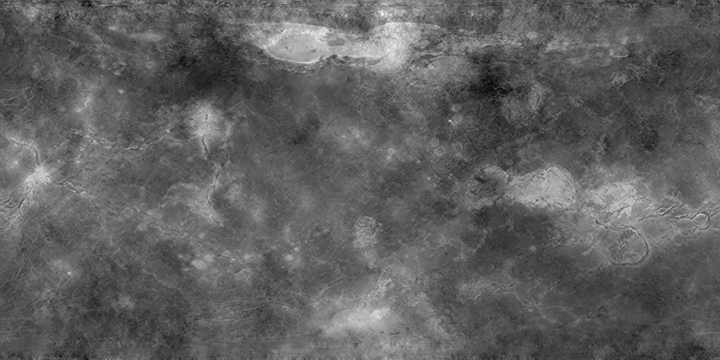
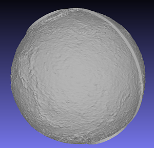
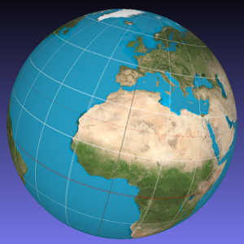

mapelia y amigos
================

Este repositorio contiene varios programas relacionados con imágenes de mapas
y ficheros 3D.

* ``mapelia`` ("mapas estilo Amelia") -- convierte mapas en figuras 3D con relieves.
* ``guapelia`` ("mapelia con interfaz guapo") -- GUI opcional para usar mapelia.
* ``pintelia`` ("pinta estilo Amelia") -- convierte mapas en figuras 3D coloreadas.
* ``poligoniza`` -- forma caras (polígonos) a partir de puntos 3D.
* ``stl-split`` -- divide un globo 3D en hemisferios norte y sur.

Los mapas son imágenes ``jpg`` o ``png`` y pueden estar en proyección
`equirectangular`_, `de Mercator`_, `central cilíndrica`_, `de Mollweide`_
o `sinusoidal`_.

.. _`equirectangular`: https://en.wikipedia.org/wiki/Equirectangular_projection
.. _`de Mercator`: https://en.wikipedia.org/wiki/Mercator_projection
.. _`central cilíndrica`: https://en.wikipedia.org/wiki/Central_cylindrical_projection
.. _`de Mollweide`: https://en.wikipedia.org/wiki/Mollweide_projection
.. _`sinusoidal`: https://en.wikipedia.org/wiki/Sinusoidal_projection

El resultado de los programas son ficheros 3D (de polígonos como `ply`_ o
`stl`_, o puntos en el espacio como `asc`_), que pueden ser visualizados y
manipulados por programas como `MeshLab`_ o `Blender`_.

.. _`ply`: https://en.wikipedia.org/wiki/PLY_(file_format)
.. _`stl`: https://en.wikipedia.org/wiki/STL_(file_format)
.. _`asc`: https://codeyarns.com/2011/08/17/asc-file-format-for-3d-points/
.. _`MeshLab`: https://en.wikipedia.org/wiki/MeshLab
.. _`Blender`: https://www.blender.org/

Instalación
===========

La primera vez que se baja este repositorio, hace falta ejecutar::

  $ python3 setup.py build_ext --inplace

de forma que se genera el módulo `projections` a partir de `projections.c`.

Si se desea modificar el fichero `projections.pyx`, hará falta además hacer
previamente::

  $ cython3 -a projections.pyx

para regenerar el fichero `projections.c`.

mapelia
=======

``mapelia`` es un programa para manipular ficheros de imágenes de mapas y
convertirlos en figuras 3D con los relieves extraídos del mapa.

Ejemplo
-------

Empezando con la siguiente imagen:

ejecutamos::

  $ ./mapelia examples/venus.png
  Processing file examples/venus.png ...
  - Extracting heights from image (channel "val")...
  Adding north cap...
  - Forming faces...
  Adding map...
  - Projecting heights on a sphere...
  - Forming faces...
  Stitching patches...
  - Forming faces...
  Adding south cap...
  - Forming faces...
  Stitching patches...
  - Forming faces...
  The output is in file examples/venus.ply

y obtenemos:

Uso
---

  usage: mapelia [-h] [-o OUTPUT] [--overwrite] [--type {ply,asc,stl}]
                 [--channel {r,g,b,average,hue,sat,val,color}] [--invert]
                 [--projection {mercator,central-cylindrical,mollweide,equirectangular,sinusoidal}]
                 [--points POINTS] [--scale SCALE] [--caps CAPS]
                 [--logo-north LOGO_NORTH] [--logo-north-scale LOGO_NORTH_SCALE]
                 [--logo-south LOGO_SOUTH] [--logo-south-scale LOGO_SOUTH_SCALE]
                 [--meridians-pos [POSITION [POSITION ...]]]
                 [--meridians-widths [WIDTH [WIDTH ...]]]
                 [--thickness THICKNESS] [--protrusion PROTRUSION]
                 [--no-ratio-check] [--blur BLUR] [--fix-gaps]
                 image

  Convierte imágenes con mapas a ficheros 3D. Toma mapas de ficheros jpg, png,
  etc., y escribe ficheros ply (polígonos), asc (nube de puntos) o stl (también
  polígonos) con una esfera que contiene las elevaciones deducidas del mapa en
  cada punto. Estos ficheros se pueden a su vez manipular con programas como
  MeshLab o Blender.

  positional arguments:
    image                 fichero de imagen con el mapa

  optional arguments:
    -h, --help            show this help message and exit
    -o OUTPUT, --output OUTPUT
                          fichero de salida (si vacío, se genera a partir del de
                          entrada) (default: )
    --overwrite           no comprobar si el fichero de salida existe (default:
                          False)
    --type ply_asc_stl    tipo de fichero a generar (default: ply)
    --channel r_g_b_average_hue_sat_val_color
                          canal que contiene la información de la elevación
                          (default: val)
    --invert              invierte las elevaciones (default: False)
    --projection mercator_central-cylindrical_mollweide_equirectangular_sinusoidal
                          tipo de proyección usada en el mapa (default:
                          mercator)
    --points POINTS       número de puntos a usar como máximo (o 0 para usar
                          todos) (default: 0)
    --scale SCALE         fracción de radio entre el punto más bajo y más alto
                          (default: 0.02)
    --caps CAPS           ángulo (en grados) al que llegan los casquetes (o auto
                          o none) (default: auto)
    --logo-north LOGO_NORTH
                          fichero de imagen con el logo norte (default: )
    --logo-north-scale LOGO_NORTH_SCALE
                          factor de escalado del logo norte (puede ser < 0 para
                          grabados) (default: 1.0)
    --logo-south LOGO_SOUTH
                          fichero de imagen con el logo sur (default: )
    --logo-south-scale LOGO_SOUTH_SCALE
                          factor de escalado del logo sur (puede ser < 0 para
                          grabados) (default: 1.0)
    --meridians-pos [POSITION [POSITION ...]]
                          lista de longitudes (en grados) con meridianos
                          (default: [0])
    --meridians-widths [WIDTH [WIDTH ...]]
                          lista de anchuras (en grados) de los meridianos
                          (default: [2])
    --thickness THICKNESS
                          grosor del objeto generado (< 1 para que sea
                          parcialmente hueco) (default: 1)
    --protrusion PROTRUSION
                          fracción en la que sobresalen meridiano y casquetes
                          del máximo (default: 1.02)
    --no-ratio-check      no arreglar el ratio alto/ancho en ciertas
                          proyecciones (default: False)
    --blur BLUR           cantidad mínima de píxeles usados para suavizar la
                          imagen (default: 0)
    --fix-gaps            intenta rellenar los huecos en el mapa (default:
                          False)

pintelia
========

``pintelia`` es un programa para proyectar mapas en esferas 3D con los colores
originales del mapa.

Ejemplo
-------

Ejecutando::

  $ ./pintelia examples/earth_equirectangular.jpg --proj equirectangular
  Processing file examples/earth_equirectangular.jpg ...
  - Forming faces...
  The output is in file examples/earth_equirectangular.ply

obtenemos:

Uso
---

  usage: pintelia [-h] [-o OUTPUT] [--overwrite]
                  [--projection {mercator,cylindrical,mollweide,equirectangular,sinusoidal}]
                  [--points POINTS] [--no-ratio-check] [--fix-gaps]
                  image

  Pinta en colores sobre la superficie de una esfera una imagen con un mapa.
  Toma mapas de ficheros jpg, png, etc., y escribe ficheros ply (polígonos).

  positional arguments:
    image                 fichero de imagen con el mapa

  optional arguments:
    -h, --help            show this help message and exit
    -o OUTPUT, --output OUTPUT
                          fichero de salida (si vacío, se genera a partir del de
                          entrada) (default: )
    --overwrite           no comprobar si el fichero de salida existe (default:
                          False)
    --projection mercator_central-cylindrical_mollweide_equirectangular_sinusoidal
                          tipo de proyección usada en el mapa (default:
                          mercator)
    --points POINTS       número de puntos a usar como máximo (o 0 para usar
                          todos) (default: 0)
    --no-ratio-check      no arreglar el ratio alto/ancho en ciertas
                          proyecciones (default: False)
    --fix-gaps            intenta rellenar los huecos en el mapa (default:
                          False)

poligoniza
==========

``poligoniza`` coge ficheros de puntos 3D (``.asc``) e intenta unirlos formando
las caras de un sólido.

Los puntos en el fichero original tienen que estar en cierto orden para que
queden bien las caras. Por ejemplo, el orden en que ``mapelia`` genera los
puntos (cuando no proyecta logos también).

Ejemplo
-------

::

  $ ./poligoniza ficheros_amelia/venus-out-12new.asc --type stl --invert
  Processing file ficheros_amelia/venus-out-12new.asc ...
  - Forming faces...
  The output is in file ficheros_amelia/venus-out-12new.stl

Uso
---

  usage: poligoniza [-h] [-o OUTPUT] [--overwrite] [--type {ply,stl}] [--ascii]
                    [--invert] [--row-length ROW_LENGTH]
                    file

  Crea un fichero de polígonos (.ply o .stl) a partir de uno con sólo los puntos
  (.asc). El fichero asc original debe tener los puntos en orden correspondiente
  a las secciones de un objeto casi-esférico.

  positional arguments:
    file                  fichero asc con las coordenadas de los puntos

  optional arguments:
    -h, --help            show this help message and exit
    -o OUTPUT, --output OUTPUT
                          fichero de salida (si vacío, se genera a partir del de
                          entrada) (default: )
    --overwrite           no comprobar si el fichero de salida existe (default:
                          False)
    --type ply_stl        tipo de fichero a generar (default: ply)
    --ascii               escribe el ply resultante en ascii (default: False)
    --invert              invierte la orientación de las caras (default: False)
    --row-length ROW_LENGTH
                          número de puntos por sección (si 0, se autodetecta)
                          (default: 0)

stl-split
=========

Divide un stl en casquete norte y casquete sur.

Ejemplo
-------

::

  $ ./stl-split mars.stl
  Processing file mars.stl ...
  Writing file mars_N.stl ...
  Writing file mars_S.stl ...

Uso
---

  usage: stl-split [-h] [-n NAME] [--number NUMBER] [--overwrite]
                   [--ignore-check]
                   file

  Divide un fichero stl. La idea es ayudar a post-procesar ficheros stl hechos
  con mapelia, para que se puedan imprimir más fácilmente. El fichero original
  no se modifica, sino que se crean dos nuevos ficheros acabados en "_N.stl" y
  "_S.stl" (o "_head.stl" y "_tail.stl" si se usa la opción --number).

  positional arguments:
    file                  fichero stl

  optional arguments:
    -h, --help            show this help message and exit
    -n NAME, --name NAME  nombre de salida (si vacío, se genera a partir del de
                          entrada) (default: )
    --number NUMBER       separar dejando el número dado de triángulos en el
                          primero (default: 0)
    --overwrite           no comprobar si los ficheros de salida existen
                          (default: False)
    --ignore-check        forzar el procesado del fichero aunque no parezca un
                          stl (default: False)

Posibles post-procesados
========================

Procesamiento con MeshLab
-------------------------

Una forma posible de continuar importando un fichero asc en meshlab:

* Filters -> Sampling (tercero por abajo) -> Poisson-disk Sampling (a
  la mitad) ; number of samples: 100000, con opción: Base Mesh
  Subsampling.
* Filters -> Normals, curvature and orientation -> Compute normals for
  pointsets ; neigbors: 20.
* Filters -> Point set -> Marching cubes (APSS) ; Grid resolution: 1000.
* Filters -> Cleaning and Repairing -> Simplification MC: Edge Collapse.
* Exportar a stl.

Material de referencia
======================

Mapas
-----

* `Finding and Using Space Image Data`_
* `Planetary Data System`_

.. _`Finding and Using Space Image Data`: http://www.planetary.org/explore/space-topics/space-imaging/data.html
.. _`Planetary Data System`: https://en.wikipedia.org/wiki/Planetary_Data_System

Proyecciones
------------

* `Equirectangular`_
* `De Mercator`_
* `Central cilíndrica`_
* `De Mollweide`_
* `Sinusoidal`_

.. _`Equirectangular`: https://en.wikipedia.org/wiki/Equirectangular_projection
.. _`De Mercator`: https://en.wikipedia.org/wiki/Mercator_projection
.. _`Central cilíndrica`: https://en.wikipedia.org/wiki/Central_cylindrical_projection
.. _`De Mollweide`: https://en.wikipedia.org/wiki/Mollweide_projection
.. _`Sinusoidal`: https://en.wikipedia.org/wiki/Sinusoidal_projection

Formatos
--------

* `ply`_ -- "polígonos" en 3D, también admite colores
* `stl`_ -- triángulos en 3D, más cutre que ply pero muy usado para imprimir en 3D
* `asc`_ -- sólo puntos 3D

.. _`ply`: https://en.wikipedia.org/wiki/PLY_(file_format)
.. _`stl`: https://en.wikipedia.org/wiki/STL_(file_format)
.. _`asc`: https://codeyarns.com/2011/08/17/asc-file-format-for-3d-points/

Procesado
---------

* `Pillow`_ -- Python Imaging Library
* `Meshlab`_ -- programa para ver y editar mallas triangulares 3D

.. _`Pillow`: https://pillow.readthedocs.io/
.. _`MeshLab`: https://en.wikipedia.org/wiki/MeshLab
